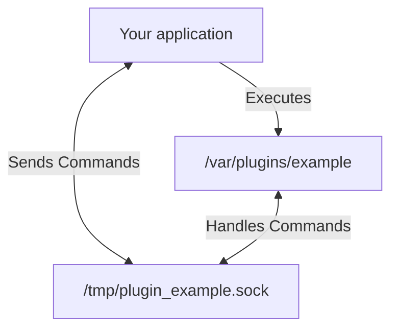

# plugin

[](https://pkg.go.dev/github.com/davidsbond/plugin) [](https://opensource.org/licenses/MIT) [](https://github.com/davidsbond/plugin/actions/workflows/go.yml)

A gRPC-based plugin system.

## How it works

This package allows you to build external plugins from your main application via the use of gRPC and UNIX domain
sockets.

Each plugin exists as a standalone binary that shares a machine with the application intending to invoke it. When your
application starts, you call the `plugin.Use` function, providing the path under which the binary resides. From here,
the binary is executed where it starts a local gRPC server listening on a unique UNIX domain socket dedicated to it.

The plugin system then obtains metadata from the plugin, ensuring it is running as expected. From here, commands defined
via protocol buffers can be invoked.



### Defining commands

This package utilizes protocol buffers when defining commands to allow for strong typing and interoperability across
languages. A command consists of a unique name and two protobuf messages, an `Input` and `Output`:

```protobuf
syntax = "proto3";

package command;

message AddInput {
  int64 a = 1;
  int64 b = 2;
}

message AddOutput {
  int64 result = 1;
}
```

Once generated, you use these messages to define a command. These commands are specified when calling `plugin.Run`.
Below is an example of a `main.go` file where we create an example plugin with an `add` command that returns the result
of adding two numbers:

```go
package main

import (
	"context"
	"log"

	"github.com/davidsbond/plugin"
)

func main() {
	config := plugin.Config{
		Name: "example",
		Commands: []plugin.CommandHandler{
			&plugin.Command[*command.AddInput, *command.AddOutput]{
				Use: "add",
				Run: func(ctx context.Context, input *command.AddInput) (*command.AddOutput, error) {
					return &command.AddOutput{
						Result: input.GetA() + input.GetB(),
					}, nil
				},
			},
		},
	}

	if err := plugin.Run(config); err != nil {
		log.Fatal(err)
	}
}
```

This `main.go` file should be compiled and placed on the same machine as the application you wish to invoke it.

### Using plugins

The `plugin.Use` function is used to execute the plugin binary, starting its gRPC server and creating a client that
communicates with it via a UNIX domain socket. Only a single instance of the plugin should exist throughout your
application as its lifecycle is managed via the `Use` and `Close` functions. Below is an example of how we start using
our `add` command:

```go
package main

import (
	"context"
	"fmt"

	"github.com/davidsbond/plugin"
)

func main() {
	ctx := context.Background()
	
	p, err := plugin.Use(ctx, "./example")
	if err != nil {
		panic(err)
	}
	
	// Remember the call Close() when you're done using the plugin!
	defer p.Close()

	output := &command.AddOutput{}
	input := &command.AddInput{
		A: 2,
		B: 5,
	}

	if err = p.Exec(ctx, "add", input, output); err != nil {
		panic(err)
	}

	fmt.Println(output.GetResult())
}
```

For a more detailed look at how the package
works, [view the documentation on pkg.go.dev](https://pkg.go.dev/github.com/davidsbond/plugin), view
the [test files](plugin_test.go) or the [plugin implementation used for testing](testdata/test_plugin/main.go).
